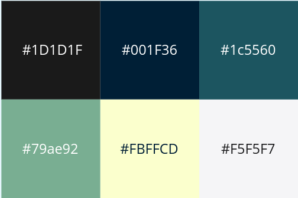
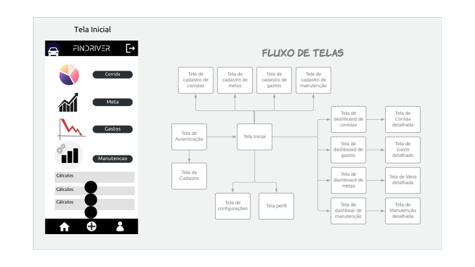

# Arquitetura

### **Histórico de Revisão**

|  **Data**  | **Versão** |             **Descrição**              |                                         **Autor**                                          |
| :--------: | :--------: | :------------------------------------: | :----------------------------------------------------------------------------------------: |
| 10/05/2023 |    1.0     |       Construção da Arquitetura        |                      [Taynara Vitorino](https://github.com/taybalau)                       |
| 17/05/2023 |    1.1     |   Protótipo de baixa e Fluxo de tela   | [Victor Hugo](https://github.com/ViictorHugoo) & [Maria Alice](https://github.com/Maliz30) |
| 12/06/2023 |    1.2     | Lista de componentes e paleta de cores |                         [Victor](https://github.com/ViictorHugoo)                          |

## Arquitetura do produto

Estão dispostos nesse capítulo as informações sobre as decisões arquiteturais do aplicativo FinDriver.

### 1. Tipo de arquitetura

Foi definido que o tipo de arquitetura do FinDriver será a de aplicativos híbridos, uma vez que possibilita o desenvolvimento e a realização de manutenções em menos tempo, considerando o curto período de desenvolvimento. Além disso, foi considerada vantajosa a limitação de recursos já que a equipe possui pouco conhecimento em desenvolvimento mobile, isso tudo somado ao compartilhamento de código entre plataformas o qual torna o desenvolvimento mais inclusivo para todos os membros.

#### 1.1 Paleta de cores

#### 1.2 Componentes

⬩ Teremos um header na tela principal para proprositos de beleza apenas  
 ⬩ Foram criados cards para conter as informações e depesas, afim de centralizar as informações obtidas  
 ⬩ Para facilitar a navegação, é usado o Tab navigator do react-native-navigation, como ele se faz possível criar uma barra fixa na parte inferior da tela, facilitando a navegação entre as telas

### 2. Estilo arquitetural

O estilo arquitetural escolhido foi Model-View-Controller (MVC), motivado pela experiência prévia de toda a equipe com o estilo. Ademais, o MVC também permite: a separação clara entre apresentação e integração de dados; uma mudança de dados independentemente da apresentação e vice-versa; e uma menor complexidade do código quando comparado ao MVP e ao MVVM.

### 3. Protótipo de baixa fidelidade

Logo abaixo, há o nosso protótipo de baixa fidelidade feito no canva e o fluxo de telas feito no Lucidchar.

## Referências

- Material do moodle da disciplina
