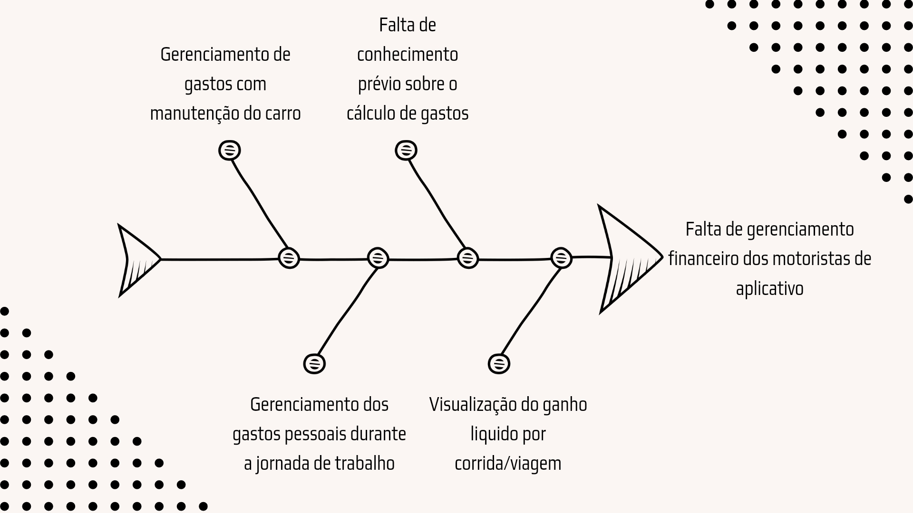

# Visão Geral do Produto

## 1. Problema

Um dos principais problemas enfrentados por motoristas de 
aplicativo é a dificuldade de gerenciamento financeiro das suas despesas e ganhos durante sua jornada de trabalho.
Muitos dos aplicativos de corrida não oferecem de forma intuitiva e organizada essas informações a fim de facilitar a administração financeira dos motoristas que os usam.
Dessa forma, os mesmo precisam utilizar métodos menos eficientes, como anotar em cadernetas,  para fazer seu planejamento financeiro. Abaixo segue o diagrama de causa-efeito do produto.

## 2. Declaração de Posição do Produto

<table>
<tbody>
  <tr>
    <td>Para</td>
    <td>Os motoristas de aplicativo</td>
  </tr>
  <tr>
    <td> Quem</td>
    <td>Não tem facilidade - ou meios acessíveis - para organizar sua renda advinda de aplicativos de corrida.</td>
  </tr>
  <tr>
    <td>O FinDriver</td>
    <td>É um aplicativo mobile.</td>
  </tr>
  <tr>
    <td>Que</td>
    <td>Disponibiliza para seus usuários informações a respeito da sua jornada de trabalho, como ganhos líquidos por corrida e gastos pessoais.</td>
  </tr>
  <tr>
    <td>Ao contrário</td>
    <td>Da uber e 99</td>
  </tr>
  <tr>
    <td>Nosso produto</td>
    <td>Dá a possibilidade para os motoristas de aplicativo de terem o controle financeiro dos seus lucros durante a jornada de trabalho.</td>
  </tr>
</tbody>
</table>

## 3. Objetivos do Produto

Possibilitar que os motoristas de aplicativo tenham o controle financeiro dos seus lucros durante a sua jornada de trabalho. 

## 4. Tecnologias a Serem Utilizadas

Nosso produto será desenvolvido utilizando tecnologias de framework mobile, banco de dados e testes.

- React Native e Expo - Frameworks mobile
- Firebase - Banco de Dados
- Jest - Testes
